# <div align="center">🧠 Aditya Ravi</div>

<div align="center">


**B.Sc. Artificial Intelligence | Università degli Studi di Pavia**  
📍 Pavia, Italy | 🎓 Expected Graduation: February 2026

[](https://linkedin.com/in/aditya-ravi-a3aab11b6)
[](mailto:adityaravu@gmail.com)
[](https://github.com/adityaravi9034)

</div>

---

##  About Me

I am a final-year AI undergraduate with **four research internships** spanning diverse domains—from temporal graph neural networks for financial prediction to multimodal deep learning for cancer immunotherapy. My research journey reflects a deliberate exploration toward understanding **principled machine learning methods** that bridge theoretical foundations with real-world impact.

Currently focused on **computational biology** and **healthcare AI**, I'm particularly interested in deep generative models, multimodal data integration, and uncertainty quantification in high-dimensional biological systems.

> *"Each project was a step toward understanding not just how to apply machine learning, but what fundamental principles govern effective learning from complex data."*

---

## 🔬 Research Connection Map


<details>
<summary><b>📊 How My Research Connects (Click to Expand)</b></summary>

| Research Area | Key Learning | Connection to PhD Goals |
|---------------|--------------|------------------------|
| **Temporal GNNs** (Finance) | Structured data, multi-relational graphs, distribution shift | Foundation for biological graph representations |
| **CGM Validation** (Healthcare) | Clinical validation, inter-individual variability, real-world data challenges | Domain expertise in healthcare AI |
| **Diffusion Models** (Theory) | Training dynamics, noise schedules, closed-loop learning | Theoretical understanding of generative models |
| **Multimodal Cancer ML** (Application) | Cross-modal fusion, uncertainty propagation, interpretability | Integration of all previous learnings |

</details>

---

## 🎓 Current Research Positions

<table>
<tr>
<td width="50%">

### 🧬 AI-ON-LAB, Politecnico Milano
**Research Intern** | Jan 2025 - Present  
*Supervisor: Dr. Vanja Miskovic*

Developing multimodal ML approaches for predicting immunotherapy efficacy in **Non-Small Cell Lung Cancer**:
- Transformer-based fusion architectures
- Contrastive alignment for clinical + genomic + imaging data
- SHAP-based interpretability analysis

</td>
<td width="50%">

### ⚛️ Statistical Physics & ML Group, UniMi
**Research Intern** | Oct 2024 - Present  
*Supervisor: Prof. Marco Gherardi*

Investigating closed-loop learning dynamics in **diffusion-based generative models**:
- PyTorch implementation of diffusion models
- Analysis of noise schedules and coupling parameters
- Statistical physics perspective on ML theory

</td>
</tr>
<tr>
<td width="50%">

### 🩺 ICDS Lab, University of Pavia
**Research Intern** | May 2024 - Nov 2024  
*Supervisor: Prof. Eleonora Maria Aiello*

**CGM validation study** in pediatric obesity:
- Temporal alignment of CGM vs plasma glucose
- MARD, Bland-Altman, and Error Grid analysis
- Clinical classification impact assessment

</td>
<td width="50%">

### 📈 University of Milan, CS Dept
**Research Intern** | Oct 2023 - May 2024  
*Supervisor: Prof. Matteo Zignani*

**Temporal Graph Neural Networks** for NASDAQ prediction:
- Relational TGCN implementation
- Multi-relational edge construction
- Hyperparameter optimization & ranking systems

</td>
</tr>
</table>

---

## 📝 Academic Presentations & Output

### Conference-Style Presentations
- 🎤 **"A Vision-Language Foundation Model for Precision Oncology"** (Nature, 2025) - AI-ON-LAB weekly meeting
- 🎤 **"Heat Death of Generative Models in Closed-Loop Learning"** - Gherardi Group seminar
- 🎤 **"Predicting Changes in Glycemic Control from Wearable Device Data"** - Medical Applications course

### Publications & Manuscripts
- 📄 **CGM vs OGTT Comparative Analysis** - Expected submission Spring 2026
- 📄 **Bachelor's Thesis**: Glucose Response Patterns Based on Macronutrient Composition

---

## 🛠️ Technical Stack

<div align="center">

### Core Languages & ML Frameworks


### ML & Data Science


### Visualization & Tools


</div>

### Specialized Skills
```
🧠 Deep Learning: CNNs, Transformers, VAEs, Diffusion Models, Graph Neural Networks
📊 Statistical Methods: Bayesian Inference, Survival Analysis, Clinical Validation Metrics
🔬 Domains: Computational Biology, Healthcare AI, Quantitative Finance
```

---

## 🎯 Research Interests & PhD Focus

```mermaid
flowchart LR
    subgraph CB[" 🧬 Computational Biology "]
        CB1[Single-cell Analysis]
        CB2[Spatial Omics]
        CB3[Perturbation Prediction]
    end
    
    subgraph DGM[" 🎲 Deep Generative Models "]
        DGM1[Diffusion Models]
        DGM2[VAEs]
        DGM3[Flow Matching]
    end
    
    subgraph ML[" 🔀 Multimodal Learning "]
        ML1[Cross-modal Fusion]
        ML2[Uncertainty Propagation]
        ML3[Modality Weighting]
    end
    
    subgraph PML[" 📐 Probabilistic ML "]
        PML1[Causal Discovery]
        PML2[Uncertainty Quantification]
        PML3[Bayesian Methods]
    end
    
    CENTER((Research<br/>Vision))
    
    CB --- CENTER
    DGM --- CENTER
    ML --- CENTER
    PML --- CENTER
```



**Core Questions I'm Pursuing:**
- How should we weight different modalities when they provide conflicting signals?
- What inductive biases are appropriate for cross-modal representation learning?
- How do we rigorously quantify uncertainty when integrating heterogeneous biological data?

---

## 📊 GitHub Analytics

<div align="center">


[](https://git.io/streak-stats)

</div>

---

## 📫 Let's Connect

<div align="center">

I'm actively applying to **PhD programs for Fall 2026** in Machine Learning, Computational Biology, and AI for Healthcare.

Open to discussing research collaborations, PhD opportunities, and innovative applications of ML in biology and medicine.

**Email:** [adityaravu@gmail.com](mailto:adityaravu@gmail.com)  
**LinkedIn:** [linkedin.com/in/aditya-ravi-a3aab11b6](https://linkedin.com/in/aditya-ravi-a3aab11b6)  
**Location:** Pavia, Italy 🇮🇹

---


*"Bridging theoretical ML research with principled applications in computational biology"*

</div>
